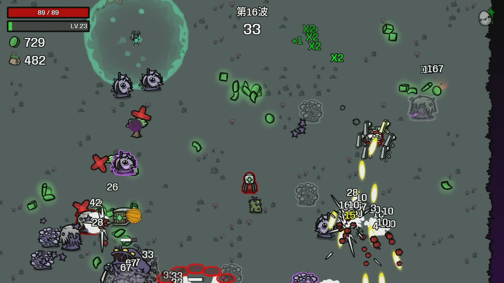

# 超级魅惑 SuperCharm

**Brotato（土豆兄弟）魅惑流全面强化 Mod**

[Steam 创意工坊](https://steamcommunity.com/sharedfiles/filedetails/?id=3796762706) · [中文](#中文) · [English](#english)

---

## 中文

魅惑流全面强化：永久魅惑、魅惑大军、boss 收编、双币道具。大军规模可在设置里调（默认 100，可开无上限），性能已针对大场面优化。

### 功能

- 魅惑不再 8 秒后死亡，小怪魅惑瞬间回满血
- 魅惑怪会被敌人锁定和攻击（魅惑后 1.5 秒保护期），你的武器不会误伤它们
- 魅惑怪继承你的击退属性，并每秒回复等同于你「生命恢复」的血量
- boss/精英死亡时 10% 概率魅惑复活（25% 血量、数值冻结在死亡波次），活着就能带进下一波，每波回复 20%
- 魅惑大军会吸引额外 boss：魅惑方战力越强，来袭的 boss 越多（第 10 波起，同屏上限 10/15/20 波 = 1/2/3 个，计入原版波次 boss，无尽随波数放宽）
- 大军上限可调：默认 100，超限自动裁掉最弱的（复活币绑定的豁免）；装 ModOptions 可在游戏内直接调 0~500 或开无上限，不装也可改配置文件
- 大场面性能优化：魅惑怪索敌和碰撞已精简，几百只同屏也不再集体"叛变"或莫名消失

### 新道具

| 道具 | 品质 | 效果 |
| --- | --- | --- |
| 魅惑币 | 紫装 T3（限 5 个） | 命中生命值低于 30% 的敌人有 1% 概率魅惑；诅咒版 2% 且 60% 血以下追加 1%。浪漫之人持币时 boss 复活率 10%→15% |
| 复活币 | 白装 T1 | +3 生命再生。随机绑定一种仍存活的被魅惑小怪（偏好血厚的），之后每波满血魅惑参战（数值随波次增长），死了下波再来；诅咒版绑定两只 |

截图里带 ✕ 标记的就是被魅惑的自己人。

### 依赖

- 必需：深海魔怪 DLC + [Darkly77-ContentLoader]
- 可选：dami-ModOptions（游戏内设置界面）

### 安装

推荐直接在 [Steam 创意工坊](https://steamcommunity.com/sharedfiles/filedetails/?id=3796762706) 订阅（需要游戏已启用 ModLoader）。

### 开发笔记

[HANDOFF.md](HANDOFF.md) 是完整的开发与踩坑记录：ContentLoader 运行时贴图、ModOptions 配置链路、Godot 翻译同语言回退、魅惑索敌与性能优化等，给想做 Brotato mod 的人参考。

### 致谢

实现方式参考了 QMtato、dami-ModOptions、Darkly77-ContentLoader 等 mod 的源码——官方没有 mod 开发文档，读别人的 mod 就是最好的文档。图标与代码均为原创。

---

## English

Vanilla charm, unchained: permanent charm, a real charmed army, boss taming, and two new items. Army size is configurable (default 100, unlimited optional), performance-tuned for huge battles.

### Features

- Charm no longer expires after 8s; charmed enemies refill to full HP
- Charmed enemies are targeted and attacked by enemies (1.5s grace after charm); your weapons never hit them
- Charmed enemies inherit your knockback and regenerate HP equal to your HP Regeneration
- Bosses/elites have a 10% chance to revive charmed on death (25% HP, stats frozen at that wave), follow you to the next wave while alive, and heal 20% per wave
- Your charm swarm attracts extra bosses: the stronger the swarm, the more bosses show up (from wave 10, concurrent cap 1/2/3 at wave 10/15/20 counting vanilla wave bosses; scales up in endless)
- Configurable swarm cap (default 100): overflow is culled weakest-first (coin-bound allies are exempt). Adjust 0-500 or go unlimited in-game with ModOptions, or via the config file
- Performance-tuned swarm: optimized targeting and collision, no more mass "defection" or silently vanishing allies in huge fights

### New items

| Item | Tier | Effect |
| --- | --- | --- |
| Charm Coin | Tier 3 (max 5) | Hits on enemies below 30% HP have a 1% chance to charm. Cursed: 2%, plus an extra 1% window below 60% HP. Romantic players get a 15% boss revive rate |
| Revival Coin | Tier 1 | +3 HP Regeneration. Binds a living charmed enemy (prefers high max-HP species); it joins every wave charmed at full HP with wave-scaled stats, even if it dies. Binds two when cursed |

In the screenshot, enemies marked with a ✕ are your charmed allies.

### Requirements

- Required: Abyssal Terrors DLC + Darkly77-ContentLoader
- Optional: dami-ModOptions (in-game settings UI)

### Install

Subscribe on the [Steam Workshop](https://steamcommunity.com/sharedfiles/filedetails/?id=3796762706) (requires ModLoader).

### Dev notes

See [HANDOFF.md](HANDOFF.md) (in Chinese) for the full development log: runtime textures with ContentLoader, the ModOptions config pipeline, Godot's same-language translation fallback, ally targeting and performance tuning.

### Credits

Implementation patterns learned from the source of QMtato, dami-ModOptions and Darkly77-ContentLoader — with no official modding docs, other mods' source is the documentation. All code and art here are original.

---

## License

[MIT](LICENSE) © Crystalhihihi
